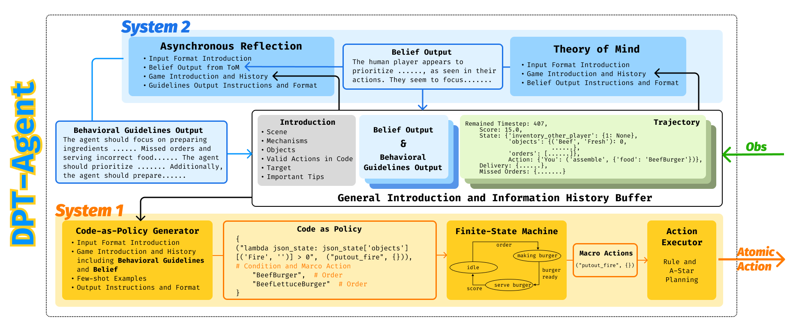

# DPT-Agent
This is the official implementation of paper ["Leveraging Dual Process Theory in Language Agent Framework for Simultaneous Human-AI Collaboration."](https://arxiv.org/abs/2502.11882)



## Installation

Create a new environment
```
conda create -n dptagent python=3.10 -y   # support python<=3.10
conda activate dptagent


# Install pytorch
# We do not need gpu
pip install torch torchvision torchaudio

# Installing dependencies

bash ./install.sh
```
## Running Instructions

### Set up LLMs

```
litellm -c llms/litellm/config.yml --port 40000

# check health
curl --location 'http://127.0.0.1:40000/health' -H "Authorization: Bearer sk-1234"
```


#### Run LLM as Indenpendent System 1 and System 2 Experiments
For single agent exp, first change the config/envs/overcooked.yaml

```
mode: burger_exp1
...
num_agents: 1
```
Then run:
```
sh scripts/exp0/openai.sh
```

#### Run Single Agent Experiments
For single agent exp, first change the config/envs/overcooked.yaml

```
mode: burger_exp1
...
num_agents: 1
```
Then run:
```
sh scripts/exp1/openai.sh
```

#### Run Collaboration Experiments with Rule-baed Agents
For collaboration exp, first change the config/envs/overcooked.yaml

```
mode: burger_exp1
...
num_agents: 2
```
Then run:
```
sh scripts/exp2/openai.sh
```

#### Run Human Experiment
For use map 2, change the config/envs/overcooked.yaml
```
mode: burger_aa_new
...
num_agents: 2
```
Then run:
```
sh scripts/overcooked/human_llm_app.sh
```
Then open the website http://localhost:5001

#### Help
For more information, please run

```shell
python llm_agent_run_act.py --help
```


## Developing Guide

We recommend using pre-commit to unify the format before commit.

```
# Init
pre-commit install

# You can run manually (maybe multiple times)
pre-commit run --all-files

# or it will automatically run when you try to commit, which is slow and seems stuck.
```

# Cite
```
@misc{zhang2025ldpt,
      title={Leveraging Dual Process Theory in Language Agent Framework for Real-time Simultaneous Human-AI Collaboration}, 
      author={Shao Zhang and Xihuai Wang and Wenhao Zhang and Chaoran Li and Junru Song and Tingyu Li and Lin Qiu and Xuezhi Cao and Xunliang Cai and Wen Yao and Weinan Zhang and Xinbing Wang and Ying Wen},
      year={2025},
      eprint={2502.11882},
      archivePrefix={arXiv},
      primaryClass={cs.AI},
      url={https://arxiv.org/abs/2502.11882}, 
}
```
