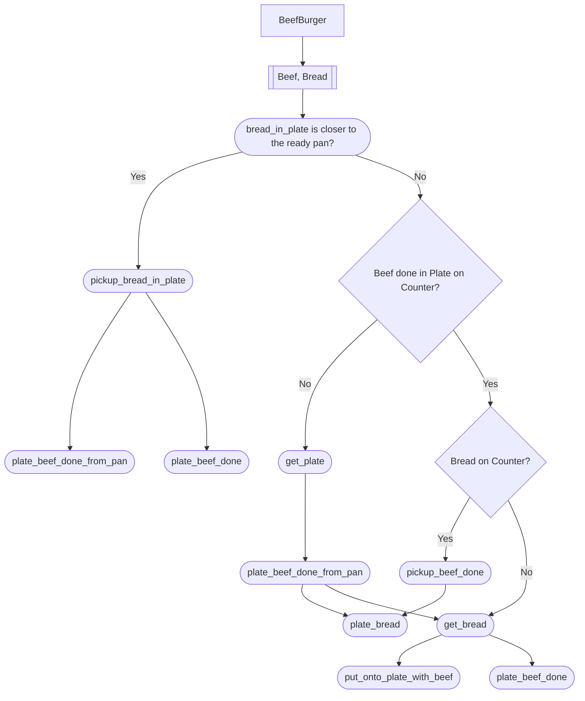

## Assemble BeefBurger

```mermaid
flowchart TD

Begin[BeefBurger] --> Comb1[[Beef, Bread]]
Comb1 --> Cond0([bread_in_plate is closer to the ready pan?])
Cond0 --> |Yes| Pick0([pickup_bread_in_plate])
Cond0 --> |No| Cond1{Beef done in Plate on Counter?} --> |No| Get1([get_plate])
Cond1 --> |Yes| Cond2{Bread on Counter?} --> |Yes| Pick1([pickup_beef_done]) --> Plate6
Cond2 --> |No| Get2
Pick0 --> Plate1([plate_beef_done_from_pan]) & Plate2([plate_beef_done])
Get1 --> Plate3([plate_beef_done_from_pan]) --> Plate6([plate_bread])
Plate3 --> Get2([get_bread]) --> Put1([put_onto_plate_with_beef]) & Plate5([plate_beef_done])
```
