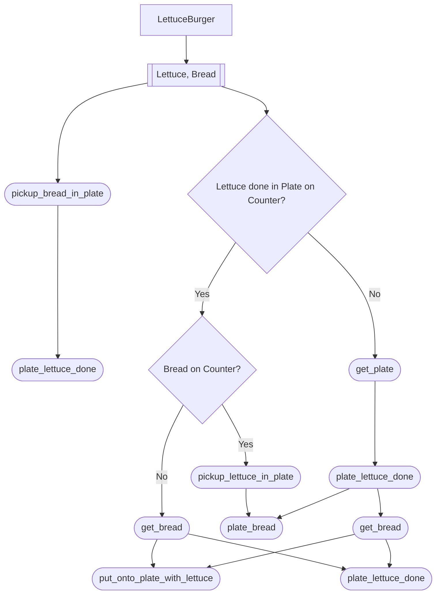

## Assemble LettuceBurger

```mermaid
flowchart TD
Begin[LettuceBurger] --> Comb1[[Lettuce, Bread]]
Comb1 --> Pick0([pickup_bread_in_plate]) --> Plate0([plate_lettuce_done])
Comb1 --> Cond1{Lettuce done in Plate on Counter?}
Cond1 --> |Yes| Cond2{Bread on Counter?} --> |No| Get1([get_bread]) --> Put2 & Plate5
Cond2 --> |Yes| Pick1([pickup_lettuce_in_plate]) --> Plate4
Cond1 --> |No| Get2([get_plate]) --> Plate6([plate_lettuce_done])
Plate6 --> Plate4([plate_bread])
Plate6 --> Get3([get_bread]) --> Put2([put_onto_plate_with_lettuce]) & Plate5([plate_lettuce_done])
```
