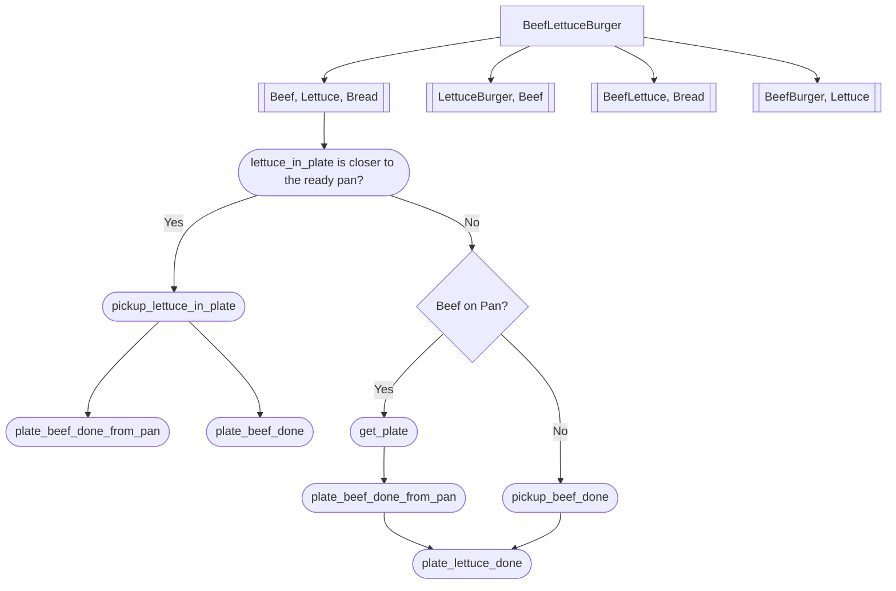
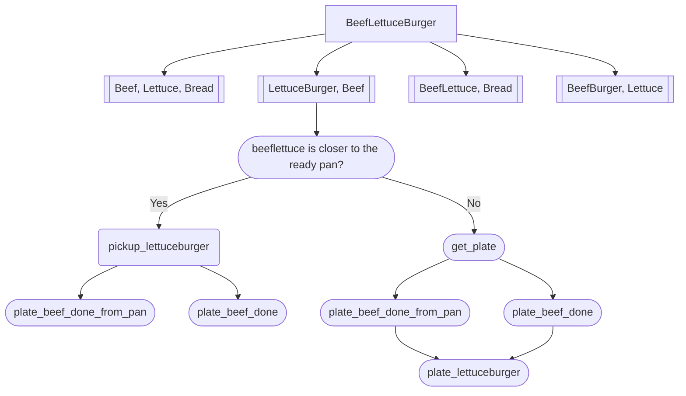
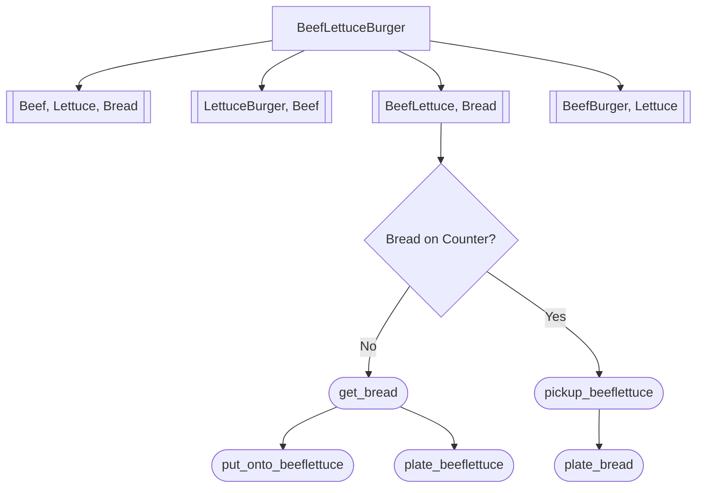
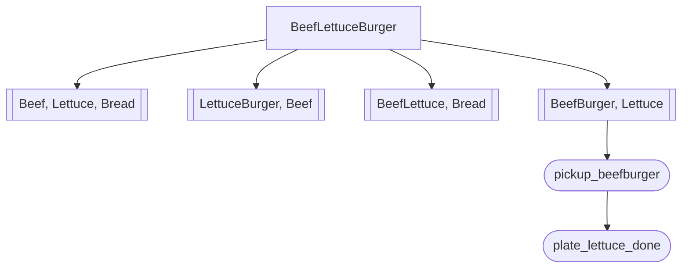

## Assemble BeefLettuceBurger

### Comb1[[Beef, Lettuce, Bread]]
Comb1[[Beef, Lettuce, Bread]] only need to process a BeefLettuce.

### Comb2[[LettuceBurger, Beef]]

### Comb3[[BeefLettuce, Bread]]

### Comb4[[BeefBurger, Lettuce]]

